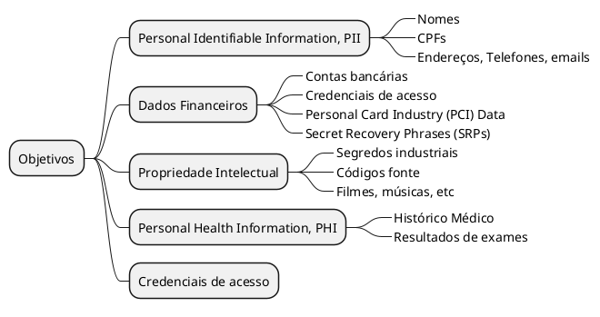

# {{ $slidev.configs.title }}
{{ $slidev.configs.description }}

---

# Objetivos de Aprendizagem
- Perceber a necessidade da segurança cibernética
- Conhecer exemplos de ataques cibernéticos
- Conhecer os atores de ameaça e seus objetivos
- Conhecer ataques a sistemas de críticos

---
layout: section
---

# Por que Segurança Cibernética?

---
layout: quote
---

# O que é Segurança Cibernética?

> A segurança cibernética ou cibersegurança (*cybersecurity*) é a área do conhecimento que cria práticas para proteção de pessoas, sistemas e dados contra ataques cibernéticos usando várias tecnologias, processos e políticas. 

---
layout: quote
---

# Por que SC?

> A medida que a sociedade passa a utilizar-se crescentemente da tecnologia da informação através de serviços de computação em nuvem (por exemplo) crescem também as oportunidades de atacantes para explorar as fragilidades desses sistemas e dos meios de comunicação que permitem o acesso a informações, aplicações e processos de empresas e usuários.

---
layout: section
---

# Como acontecem ataques cibernéticos?

---

# Colonial Pipeline (2021)
*Ransomware*

**Alvo** A *Colonial Pipeline* é a maior operadora de oleodutos de produtos refinados dos EUA.

**Ataque** O grupo criminoso *DarkSide* infectou os sistemas de faturamento da empresa com um *ransomware*.

**Consequência** A empresa fechou todo o oleoduto por vários dias para conter o ataque.

**Impacto** Causou pânico e escassez de combustível em toda a Costa Leste dos EUA, levando o governo a declarar estado de emergência.

> Ataques cibernéticos podem ter consequências físicas e sociais imediatas.

---

# Colonial Pipeline (2021)

> Um grupo de *hackers* desconectou completamente a rede e roubou mais de 100 GB de informações do oleoduto da empresa Colonial. O duto transporta mais de 2,5 milhões de barris de óleo por dia, o que corresponde a 45% do abastecimento de diesel, gasolina e querosene de aviação da costa leste dos EUA.

[O ataque de hackers a maior oleoduto dos EUA que fez governo declarar estado de emergência](https://www.bbc.com/portuguese/internacional-57055618)

---

# Colonial Pipeline (2021)

<Youtube id="0g14ugtxniI" />

---

# SolarWinds (2020)
Confiabilidade dos *Softwares*

**Alvo** A SolarWinds, uma empresa que desenvolve software de monitoramento de redes (Orion).

**Ataque** Atores estatais (suspeita-se da Rússia) comprometeram o processo de *build* da SolarWinds e inseriram um código malicioso (cavalo de Troia) em uma atualização legítima do software Orion.

**Consequência** Clientes que instalaram a atualização abriram uma *backdoor* para os atacantes.

**Impacto** Afetou milhares de organizações, incluindo agências governamentais dos EUA (como o Departamento de Estado e o Pentágono) e grandes empresas privadas.

> Confiar no *software* não é mais suficiente; a segurança da cadeia de suprimentos é vital.

---

# Equifax (2017)
Exploração de Vulnerabilidade

**Alvo** A Equifax, uma das maiores agências de crédito dos EUA, com dados sensíveis de milhões de consumidores.

**Ataque** Hackers exploraram uma vulnerabilidade conhecida no *framework web* Apache Struts [(CVE-2017-5638)](https://www.cve.org/CVERecord?id=CVE-2017-5638), para o qual um *patch* já estava disponível há meses. A Equifax não havia aplicado a atualização.

**Consequência** Os invasores tiveram acesso não autorizado ao sistema por meses e exfiltraram grandes volumes de dados.

**Impacto** Dados pessoais de aproximadamente 147 milhões de pessoas foram comprometidos, incluindo nomes, números de seguridade social (CPF americano), datas de nascimento e endereços. O custo total do incidente para a empresa ultrapassou US$ 1,4 bilhão.

> A falha em aplicar *patches* de segurança básicos (gestão de vulnerabilidades) pode ter consequências catastróficas e financeiras gigantescas.

---

# Quem nos ataca?

- *Hackers*
- Invasores, Atacantes
- Atores estatais
- Grupos criminosos

---
layout: section
---

# Atores de Ameaça

---
layout: quote
---

> Nem todo hacker é um adolescente no porão. Os motivos e patrocinadores variam muito.

---

# Principais Atores de Ameaça

- Criminosos Cibernéticos
- Hackvistas
- Estados, nações
- Insiders

---

# Atores de Ameaça
Criminosos cibernéticos

- **Motivação** Financeira, lucro individual ou de grupo
- **Ações** Ransomware, fraudes online diversas, roubo de dados pessoais, financeiros ou de saúde

---

# Atores de Ameaça
Hackvistas

- **Motivação** Ideológica ou política.
- **Ações** Desfiguração de sites (pichação virtual), ataques de negação de serviço (DDoS) para derrubar serviços, vazamento de documentos para promover uma causa, etc

---

# Atores de Ameaça
Nações

- **Motivação** Espionagem, sabotagem, vantagem geopolítica.
- **Ações** Ataques sofisticados e bem financiados a infraestruturas críticas, governos e empresas de defesa. (Ex: Stuxnet, SolarWinds)

---

# Atores de Ameaça
*Insiders*

- **Motivação** Podem ser maliciosos (funcionário insatisfeito vendendo dados) ou acidentais (funcionário que cai em um *phishing* e expõe a rede)
- **Ações** Vazar informações, instalar malware, causar danos por negligência ou por engenharia social

---
layout: section
---

# Objetivos dos Atores de Ameaça

---

# O que os Atacantes Buscam?

- Informações Pessoais Identificáveis (PII): Nomes, CPFs, RG, endereços, números de telefone. Usadas para roubo de identidade e fraudes.
- Dados Financeiros: Números de cartões de crédito, contas bancárias, credenciais de acesso a bancos. O alvo clássico para ganho financeiro direto.

---

# O que os Atacantes Buscam?

- Propriedade Intelectual (PI): Segredos industriais, fórmulas (ex: da Coca-Cola), projetos de engenharia, código-fonte de software. Muito visado por concorrentes e estados-nação.
- Credenciais de Acesso (Logins e Senhas): A chave para o castelo. Permitem que o atacante se passe por um usuário legítimo e acesse sistemas e dados internos.
- Dados de Saúde (PHI): Históricos médicos, resultados de exames. Extremamente sensíveis e valiosos no mercado negro para chantagem ou fraudes em seguros.

---
layout: center
---

---
layout: section
---

# Sistemas Críticos

---

# Infraestruturas Críticas
Conceito

> São ativos, sistemas e instalações cuja interrupção ou destruição teria um impacto considerável sobre a segurança nacional, econômica e social de um país ou região.

---

# Infraestruturas Críticas
Setores

- Energia (Redes elétricas, usinas nucleares)
- Água (Estações de tratamento e distribuição)
- Transportes (Controle de tráfego aéreo, ferrovias, metrô)
- Saúde (Hospitais, sistemas de emergência)
- Finanças (Sistemas de pagamento, bancos)
- Comunicações (Redes de *internet* e telefonia)

---

# Ataque ao Sistema de Água da Flórida (2021)

- **Ataque** Um atacante (suspeita-se de um insider ou acesso remoto comprometido) invadiu o sistema de controle da estação de tratamento de água da cidade de Oldsmar, Flórida
- **Ataque** O atacante alterou remotamente os níveis de hidróxido de sódio (soda cáustica) na água de 100 partes por milhão para 11.100 partes por milhão. A soda cáustica é usada em pequenas quantidades para controlar a acidez, mas em níveis altos é um corrosivo perigoso.
- **Consequência** Felizmente, um operador percebeu a mudança e reverteu a ação antes que a água tratada fosse distribuída para a população.

> Sistemas de controle industrial (ICS/SCADA) legados são vulneráveis e um ataque bem-sucedido poderia ter envenenado milhares de pessoas

---

# Referências

- [O que é cibersegurança?](https://www.ibm.com/br-pt/think/topics/cybersecurity)

---
src: /snippets/end.md
---