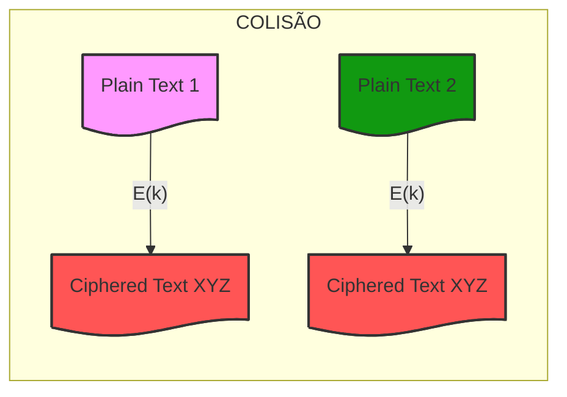

# {{ $slidev.configs.title }}
{{ $slidev.configs.description }}

---

# Objetivos de Aprendizagem 

- Distinguir cifras de bloco e de fluxo
- Conhecer o *Data Encryption Standard*

---

# Agenda 

- Cifras de fluxo e de bloco
- Cifra de Feistel
- DES
- Modos de Operação
- Open SSL

---
layout: section
---

# Cifras de Fluxo e de Bloco

---

# Cifras de Fluxo
*Stream ciphers*

- Encripta um fluxo de dados digital **bit a bit**, **byte a byte**, etc
- O fluxo de chaves (*key stream*), $k_i$, tem o tamanho do fluxo de bits de texto claro ($p_i$)
- Para chaves aleatórias, a cifra é inquebrável (*One Time Pad*)
- Problema de compartilhamento de chaves

---
layout: image
image: /modelo_cifra_fluxo.png
backgroundSize: contain
---

---

# Cifras de Fluxo

- Geração de fluxo de bits feita via função algorítmica no emissor e receptor (**pseudo aleatória**)
- O algoritmo é afetado pela chave
- O fluxo de bits deve ser criptograficamente forte

---

# Cifras de Bloco

- O texto claro é tratado como um todo ou em **partes de tamanho fixo**
- Blocos de 64 ou 128 bits
- Emissor e receptor compartilham uma chave simétrica

---
layout: image
image: /modelo_cifra_bloco.png
backgroundSize: contain
---

---
layout: two-cols-header
---

# Cifra de Bloco Ideal

::left::

- Mapeamento reversível
- Para blocos de $n$ bits existem:
    - $2^n$ blocos possíveis
    - $2^n!$ mapeamentos reversíveis 

::right::

| Texto Claro | Texto Cifrado |
|:---------------:|:-----------------:|
| 00              | 11                |
| 01              | 10                |
| 10              | 00                |
| 11              | 01                |

---

# Mapeamento Irreversível

| Texto Claro     |     Texto Cifrado |
|:---------------:|:-----------------:|
| 00              | 11                |
| 01              | 10                |
| 10              | 01                |
| 11              | 01                |

---
layout: two-cols-header
---

# Cifra de Bloco Ideal

::left::

- Para blocos de 3 bits ($n=3$) existem:
    - 8 blocos possíveis ($2^n$)
    - $40.230$ mapeamentos reversíveis ($2^n!$)

::right::

| Texto Claro | Texto Cifrado |
|:-----------:|:-------------:|
| 000 (0)	|   000 (0) |
| 001 (1)	|   010 (2) |
| 010 (2)   |	101 (5) |
| 011 (3)   |	111 (7) |
| 100 (4)   |	001 (1) |
| 101 (5)   |	100 (4) |
| 110 (6)   |	011 (3) |
| 111 (7)   |  	110 (6) |

---
layout: image-right
image: /cifra_ideal_4bits.png
backgroundSize: contain
---

# Cifra de Bloco Ideal

- Cifra reversível
- Mapeamentos de encriptação e decriptação definidos por tabulação
- Exemplo, cifra de substituição de 4 bits ($n=4$)

---

# Cifra de Bloco Ideal

- Para blocos de 4 bits ($n=4$) existem:
    - 16 blocos possíveis ($2^n$)
    - Mais de $20 \times 10^{12}$ mapeamentos reversíveis

---

# Cifra de Bloco Ideal

| $n$     | Blocos  | Permutações   |
|:-------:|:-------:|:-------------:|
| $2$     | $4$     |   $16$  |
| $3$     | $8$     |   $40.230$  |
| $4$     | $16$    |   $20.922.789.888.000$  |
| $5$     | $32$    |   $32!$  |
| $\vdots$| $\vdots$|   $\vdots$  |
| 128 (AES-128)     | $2^{128}$ |   **?**  |

---

# Cifra de Bloco Ideal
Fragilidades

- Para $n$ pequeno a CBI equivale a cifra de substituição, logo sujeita a **análise estatística do texto** (força bruta)
- Considerando $n$ suficientemente grande e uma substituição reversível, as características estatísticas do texto são mascaradas

---
layout: fact
---

# O que seria $n$ suficientemente grande?

---

# Ataques de Aniversário
*Birthday attacks*

>  Ocorrem quando a quantidade de blocos cifrados utilizando a mesma chave se aproxima de $2^{n/2}$

- Por exemplo, o DES com chave de 64 bits ($n=64$)
- Após cifrar $2^{32}$ blocos, a probabilidade de uma colisão se torna significativa (maior que 50%)

---
layout: quote
---

# Colisões

> Uma colisão em blocos cifrados ocorre quando dois blocos de texto cifrado diferentes são iguais, ou quando dois blocos de texto claro diferentes produzem o mesmo bloco de texto cifrado sob a mesma chave.

---
layout: center
---

---

# Colisões

Uma colisão em blocos cifrados pode permitir:
- Quebra da confidencialidade
- Quebra da integridade (no caso de autenticação)
- Recuperação de informações sobre o texto claro

---
layout: quote
---

> Uma cifra de bloco com $n$ suficientemente grande é **impraticável**

---

# Cifra de Bloco Ideal
Fragilidades

<!-- - O mapeamento coincide com a própria chave
- Para o exemplo de 4 bits é necessário uma chave de 4 bits x 16 linhas = 64 bits -->

- Regra geral:
    - Tamanho do bloco: $n$
    - Tamanho da chave: $n \cdot 2^n$
    - Para o exemplo de 4 bits é necessário uma chave de 4 bits x 16 linhas = 64 bits -->

---

# Tamanho de Blocos
Consenso Prático

| $n$ (bits) | Status |
|:-----------:|-------------|
| 64	|   **Inseguro** para uso geral. Exemplos: DES, 3DES, Blowfish (64 bits). Ataques de aniversário viáveis. |
| 128	|   Padrão atual **seguro**. É o tamanho usado no AES, $2^{64}$ blocos.
| 256   |	Segurança de margem extremamente alta. Usado em algumas cifras como AES-256 (embora o bloco ainda seja 128 bits, há cifras com blocos de 256 bits como Serpent ou Rijndael). |

---
layout: section
---

# Cifra de Feistel

---
layout: quote
---

# Cifra de Feistel

> Conceito de uma cifra de produto, (execução de duas ou mais cifras simples em sequência) tornando o resultado ou produto final criptograficamente mais forte do que qualquer uma das cifras componentes.

---

# Cifra de Feistel
Características

- Cifra de bloco com chave de tamanho $k$ bits + bloco de $n$ bits
    - Transformações: $2^k$
-  Cifra de bloco ideal
    - Transformações: $2^n!$
- Alternância entre permutações e substituições

---
layout: quote
---

# Cifra de Feistel
Tamanhos de chave e blocos

> A chave e o bloco atendem a propósitos diferentes. Não há razão matemática ou prática para que esses dois números sejam iguais.

---
layout: two-cols-header
---

# Cifra de Feistel
Tamanhos de chave e blocos

:: left ::

Bloco ($n$)
- Tem o propósito de determinar a granularidade do processamento e a resistência a ataques de aniversário
- Precisa de $n$ de pelo menos 128 bits para evitar colisões

:: right ::

Chave ($k$)
- Determina o espaço de busca exaustiva (força bruta)
- Precisa ser grande (128, 192, 256 bits) para inviabilizar busca exaustiva

---

# Cifra de Feistel
Tamanhos de chave e blocos

| Cifra       | Bloco ($n$) | Chave ($k$)     | Observação                                      |
|-------------|------------------|----------------------|-------------------------------------------------|
| DES     | 64 bits          | 56 bits              | Inseguros para os padrões atuais              |
| 3DES    | 64 bits          | 112 ou 168 bits      | Chave maior, mas bloco ainda pequeno (vulnerável a aniversário) |
| Blowfish| 64 bits          | 32 a 448 bits        | Flexibilidade na chave, mas bloco limitado      |
| Twofish | 128 bits         | 128, 192, 256 bits   | Padrão moderno: bloco grande, chave variável    |

---

# Cifra de Feistel
Características

- Cifra de bloco com chave de tamanho $k$ bits + bloco de $n$ bits
    - Transformações: $2^k$
-  Cifra de bloco ideal
    - Transformações: $2^n!$
- Alternância entre permutações e substituições

---
layout: quote
---

# Cifra de Feistel
Substituições

> Cada elemento de texto claro ou grupo de elementos é substituído exclusivamente por um elemento ou grupo de elementos de texto cifrado correspondente.

---
layout: quote
---

# Cifra de Feistel
Permutações

> Uma sequência de elementos de texto claro é permutada, ou seja, nenhum elemento é acrescentado, removido ou substituído na sequência, mas a ordem em que os elementos aparecem é modificada.

---

# Difusão e Confusão

- A cifra de Feistel é uma aplicação prática de uma proposta de *Claude Shannon* (1949) para uma cifra de produto que alterne funções de confusão e difusão
- Difusão e confusão são os ingredientes essenciais para que qualquer sistema criptográfico seja capaz de frustrar a criptoanálise estatística

---

# Difusão

- Dissipa a estrutura estatística do texto
- Cada digíto do texto claro afeta vários dígitos do texto cifrado
- Seja uma mensagem $M = m_1 + m_2 + m_3 + \dots$
- Cada caractere, $y_n$, do texto cifrado é dado por:

$$
y_n = \sum_{i=1}^k{m_{n+i}}mod26
$$

---

# Difusão
Principais técnicas

- Permutações (Transposições), através da reorganização dos bits/bytes dentro do bloco para espalhar a influência de cada bit de entrada por todo o bloco de saída
- Operações de Deslocamento (*Shifting*), disseminar bits para posições distantes
- Múltiplas operações XOR
- Redes de *Feistel*

---

# Confusão

- Agrega complexidade ao relacionamento estatístico entre o texto claro e o texto cifrado
- Mesmo que o atacante tenha alguma ideia das estatísticas do texto a complexidade conferida pela confusão impede a dedução da chave

---
layout: quote
---

> A confusão refere-se à complexidade da relação entre a chave secreta e o texto cifrado. O objetivo é tornar essa relação tão complexa e não-linear que seja praticamente impossível para um atacante deduzir informações sobre a chave a partir do texto cifrado

---

# Confusão 

- Um observador que veja o texto cifrado não deve ser capaz de deduzir a chave usada
- Cada bit do texto cifrado deve depender de múltiplos bits da chave de forma complexa
- A relação chave/texto cifrado deve ser estatisticamente indetectável

---

# Confusão
Principais técnicas

- Operações não lineares:
    - S-boxes (Caixas de Substituição): Tabelas que introduzem não-linearidade
    - Operações modulares com números primos
    - Funções matemáticas complexas

---
layout: image-right
image: /feistel1.png
backgroundSize: contain
---

# Cifra de *Feistel*
Estrutura (**encriptação**)

---
layout: image-right
image: /feistel2.png
backgroundSize: contain
---

# Cifra de *Feistel*
Estrutura (**decriptação**)

---
layout: image-right
image: /feistel_single.png
backgroundSize: contain
---

# Cifra de *Feistel*
Estrutura

| Entrada | Bloco de texto claro com 2w bits dividido em LE0 e RE0 |
|:-------:|--------------------------------------------------------|
| Saída   | LE1 e RE1, são a entrada da próxima rodada             |
| Rodadas | N rodadas                                              |
| Função  | XOR                                                    |
| Chave   | K, modificada a cada rodada                            |

---

# Cifra de *Feistel*
Parâmetros

| Bloco    | Maior segurança com blocos maiores, porém com maior custo computacional                          |
|:--------:|--------------------------------------------------------|
| Rodadas  | Mais rodadas, maior segurança                            |
| Função   | XOR                                                    |

---

# Cifra de *Feistel*
Parâmetros

| Chave    | Maior segurança com maiores chaves                     |
|:--------:|--------------------------------------------------------|
|          | Maior custo computacional                              |
| Algoritmo de subchave e $F$ | Aumentam a dificuldade da criptoanálise |

---
layout: center
---

<Youtube id="8l9xAvuGJFo" />

---
layout: section
---

# *Data Encription Standard*

---

# DES
*Data Encription Standard*

- Desenvolvido pela IBM em 1975
- Adotado pelo NIST em 1977
- Reafirmado em 1994
- Substituído pelo *Triple*$* DES em 1999
- Criptografia mais utilizada antes do AES (2001)
- *$*Triple* DES substituído pelo AES em 2001

---

# DES
Características

- Blocos de dados de 64 bits
- Chave de 64 bits com uso efetivo de 56 bits (8 bits de paridade)
- 16 rodadas 

---
image: https://www.includehelp.com/cryptography/Images/des-1.jpg
backgroundSize: contain
layout: image-right
---

# DES
Encriptação

---
image: https://scaler.com/topics/images/des-algorithm-initial-permutation-table.webp
backgroundSize: contain
layout: image-right
---

# DES
*Initial permutation*

- Reorganiza os 64 bits do bloco (permutação)

---

# DES
Geração de Subchaves

> Cada uma das 16 rodadas do DES demanda uma chave de rodada de 48 bits. Cada chave de rodada é gerada a partir da chave original de 64 bits.

---
image: https://scaler-topics-articles-md.s3.us-west-2.amazonaws.com/key-generation-in-des-algorithm.webp
backgroundSize: contain
layout: image-right
---

# DES
Geração de Subchaves
1. Os bits 8, 16, 24, 32, 40, 48, 56 e 64 são removidos (bits de paridade)
2. A chave passa de 64 para 56 bits e sofre uma permutação resultando em PC-1 (*permuted choice*)

---
image: https://scaler.com/topics/images/des-algorithm-permutation-table.webp
backgroundSize: contain
layout: image-right
---

# DES
Geração de Subchaves

3. Os 56 bits de PC-1 sofrem um processo chamado *Compression Permutation* 
4. PC-2 é gerado com 48 bits que é a chave da rodada
6. Deslocamentos são realizados em PC-1 e PC-2 para gerar as 16 chaves subchaves de cada rodada

---
image: https://www.includehelp.com/cryptography/Images/des-1.jpg
backgroundSize: contain
layout: image-right
---

# DES
Função de Rodada
- *Expansion Permutation*
- XOR
- Substituição
- Permutação

---

# Função de Rodada
*Expansion Permutation*

- O bloco de 64 bits é dividido ao meio $R0$ e $L0$
- $R0$ e $L0$ tem 32 bits, cada
- $R0$ é expandido para 48 bits
- Efeito avalanche

---
image: https://scaler.com/topics/images/key-mixing-des-algorithm.webp
backgroundSize: contain
layout: image-right
---

# Função de Rodada
XOR

> A função XOR é aplicada bit a bit entre a chave de rodada e $R0$

---
image: https://scaler.com/topics/images/copy-of-s-boxes-des-algorithm.webp
backgroundSize: contain
layout: image-right
---

# Função de Rodada
S-box

> A substituição é usada para tornar os dados mais complexos, dificultando a decifragem. Oito tabelas pré-fabricadas (S-Boxes), são usadas para transformar cada entrada de 6 bits em uma saída de 4 bits.

---
image: https://scaler.com/topics/images/permutation-table-in-des.webp
backgroundSize: contain
layout: image-right
---

# Função de Rodada
Permutação

---

# DES
Vulnerabilidades

- Tamanho de chave (56 bits) torna o DES vulnerável a ataques de força bruta
    - [DES Challenges](https://en.wikipedia.org/wiki/DES_Challenges)
    - Levou ao desenvolvimento do 3DES
- Ataques de tempo
- Criptoanálise diferencial e linear

---
layout: quote
---

# DES

> DES e 3DES são algorítmos criptográficos considerados obsoletos e foram oficialmente substituídos pelo AES

---
layout: center
---

<Youtube id="lqrY5IJDATM" />

---
layout: section
---

# Modos de Operação

---
layout: quote
---

> Como utilizar cifras de bloco para um conjunto de dados maior do que o tamanho do bloco?

---

# Modos de Operação

- Descrevem como aplicar cifras de bloco a mensagens mais longas
    - *Electronic Codebook Mode* (ECB)
    - *Cipherblock Chaining Mode* (CBC)
    - *Cipher Feedback Mode*
    - *Output Feedback Mode*
    - *Counter Mode* (*Galois*)

---
layout: image-right
image: https://dz2cdn1.dzone.com/storage/temp/11913961-ecb.png
backgroundSize: contain
---

# ECB
*Electronic Code Book*

- Cada bloco é criptografado de forma independente com a mesma chave
- O ECB fragiliza a cifra, pois blocos idênticos de texto claro produzem blocos idênticos de texto cifrado
- Cria padrões "visíveis" na cifra (ECB *Penguin*)

---
layout: image
image: https://www.jmunixusers.org/presentations/cryptography/images/block-ecb-penguin.png
backgroundSize: contain
---

---
layout: image-right
image: https://dz2cdn1.dzone.com/storage/temp/11913962-cbc.png
backgroundSize: contain
---

# CBC
*Cipher Block Chaining*

- Cada bloco de texto claro é combinado (usando um XOR) com o texto cifrado do bloco anterior antes de ser criptografado
- No primeiro bloco utiliza-se um vetor de inicialização (IV)
- Evita a repetição de padrões do EBC
- Sensível a propagação de erros

---
layout: image-right
image: https://cdn-images.postach.io/dbabb368-8101-471e-8db0-891899ecc396/447564dd-a88d-4769-9a56-22deaae1f819/b0f0252b-17ed-4d53-9f73-fe1c7452f6e2.png
backgroundSize: contain
---

# Counter Mode
*Galois*

- Um contador é usado para gerar uma sequência de blocos de chave única combinados com os dados de entrada para serem criptografados juntos
- Acrescenta um código de autenticação para cada bloco
- Realiza criptografia e autenticação em um processo único
- Evita propagação de erros
- Dificulta falsificação

---
layout: quote
---

# OpenSSL

---

> OpenSSL é uma biblioteca de *software* de código aberto e uma ferramenta de linha de comando usada para implementar os protocolos SSL e TLS para comunicações seguras.

---

# OpenSSL

- Implementação de algoritmos criptográficos
- Geração de chaves
- Geração e verficação de Certificados
- Funções de *Hash* (*message digest*)

---
layout: quote
---

# SSL
*Secure Socket Layer*

> SSL é um protocolo de segurança da Internet baseado em criptografia desenvolvido pela Netscape em 1995, com o objetivo de garantir a privacidade, autenticação e integridade de dados nas comunicações da Internet.

---

# SSL ou TLS?
*Transport Layer Security*

> O SSL é o antecessor direto de outro protocolo chamado TLS. Em 1999, o IETF (*Internet Engineering Task Force*) propôs uma atualização do SSL

---
layout: image
image: https://cheapsslweb.com/blog/wp-content/uploads/2025/06/tls-version-history-1024x480.webp
backgroundSize: contain
---

---

# OpenSSL
Como usar?

- Linha de comando
- `openssl` + Subcomando + Opções
- Exemplos
    - `openssl help`

---
image: /ssl_commands.png
layout: image-right
backgroundSize: contain
---

# OpenSSL
Comandos

---
image: /ssl_md.png
layout: image-right
backgroundSize: contain
---

# OpenSSL
*Message Digests*

---
image: /ssl_ciphers.png
layout: image-right
backgroundSize: contain
---

# OpenSSL
Algorítmos criptográficos

---

# OpenSSL
Exemplos

- Criptografia

`openssl enc -aes-256-cbc -in file.txt -out file.enc`

- Chave Privada

`openssl genpkey -algorithm RSA -out private_key.pem -aes256`

- Verificando informação em um certificado

`openssl x509 -in certificate.pem -text -noout`

---
layout: fact
---

# Perguntas

---

# Referências 
- Criptografia e Segurança de Redes. *Stallings, W.* Capítulo 3.
- [DES NIST](https://csrc.nist.gov/pubs/fips/46-3/final)
- [DES Algorithm](https://www.scaler.com/topics/des-algorithm/)
- [O que é OpenSSL?](https://www.ssldragon.com/pt/blog/que-e-openssl/)
- [SSL e TLS](https://www.cloudflare.com/pt-br/learning/ssl/what-is-ssl/)

---
src: /snippets/end.md
---