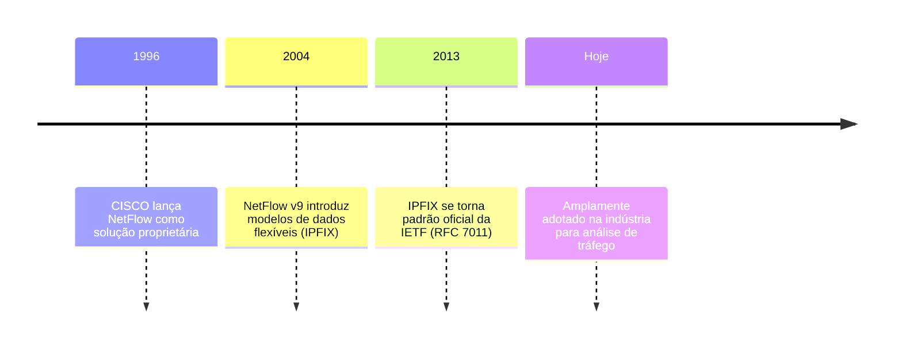
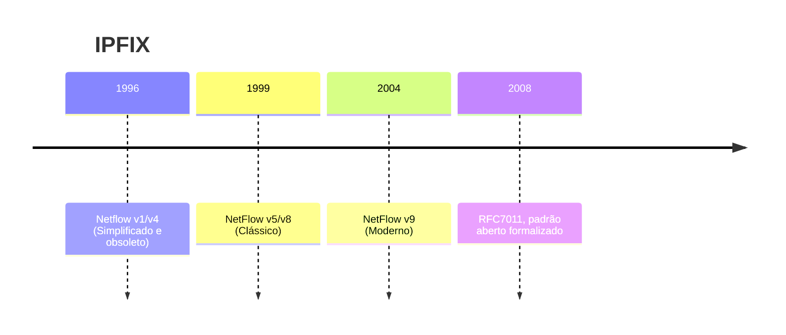

# {{ $slidev.configs.title }}
{{ $slidev.configs.description }}

---

# Objetivo de Aprendizagem

- Conhecer o conceito de monitoramento de fluxo

---

# Agenda 

- O que é Monitoramento de Fluxo
- Conceitos Fundamentais
- NetFlow: O Padrão
- Versões do NetFlow
- Componentes de um Sistema NetFlow
- Casos de Uso
- Ferramentas e Soluções

---
layout: section
---

# O que é Monitoramento de Fluxo?

---
layout: quote
---

# Monitoramento de Fluxo

> Técnica de análise de tráfego de rede que coleta informações sobre fluxos de pacotes (fluxos de dados) que passam por um equipamento de rede, como um roteador ou *switch*. Permite visualizar como os dados fluem pela rede, identificar padrões de comunicação, detectar anomalias e otimizar o desempenho

---

# Fluxo de Rede
Elementos
- IP de origem
- IP de destino
- Protocolo 
    - (TCP, UDP, ICMP, etc.)
- Porta de origem
- Porta de destino

> Todas as comunicações que compartilham essas características são consideradas um único fluxo

---

# Por que Monitorar Fluxos?

1. **Visibilidade de Rede**
    - Entender como dados fluem pela infraestrutura
2. **Segurança**
    - Detectar tráfego anômalo e possíveis ataques
3. **Performance**
    - Identificar congestionamentos e otimizar recursos

---

# Por que Monitorar Fluxos?

4. **Conformidade** 
    - Documentar fluxos para auditorias e regulamentações
5. **Faturamento**
    - Determinar uso de banda por departamento ou cliente


---
layout: section
---

# NetFlow: O Padrão da Indústria

---
layout: quote
---

# NetFlow

> Protocolo de exportação de dados desenvolvido pela **CISCO** que permite coletar informações sobre fluxos de rede passando por um roteador ou *switch*, exportando-as para um **coletor central** (*flow collector*)

---

# Histórico e Desenvolvimento




---

# Arquitetura do NetFlow

```
┌─────────────────────────────────────────────────────┐
│  ROTEADOR / SWITCH COM NETFLOW ATIVO                │
│  • Monitora fluxos                                  │
│  • Coleta dados dos pacotes                         │
│  • Exporta records periodicamente                   │
└──────────────┬──────────────────────────────────────┘
               │ (UDP Port 2055 ou configurável)
               │ NetFlow Records
               │
┌──────────────▼──────────────────────────────────────┐
│  FLOW COLLECTOR                                     │
│  • Recebe dados dos roteadores                      │
│  • Normaliza e armazena                             │
│  • Prepara para análise                             │
└──────────────┬──────────────────────────────────────┘
               │
┌──────────────▼──────────────────────────────────────┐
│  ANALYSIS TOOLS                                     │
│  • Visualização e relatórios                        │
│  • Alertas e notificações                           │
│  • Análise forense                                  │
└─────────────────────────────────────────────────────┘
```

---
layout: image-right
image: https://www.ibm.com/docs/en/SSCVHB_1.3.0/collector/images/v9_export_packet.jpg
backgroundSize: contain
---

# NetFlow *record* V9

| *Template FlowSet* | Descrição |
|-------|-----------|
| IP Origem / Destino | Endereços IP participantes |
| Portas | Portas de origem e destino |
| Protocolo | TCP, UDP, ICMP, etc. |
| *Timestamp* | Quando o fluxo começou e terminou |
| *Bytes* / Pacotes | Volume de dados transferidos |
| Interface | Portas de entrada e saída |

---
layout: section
---

# Versões do NetFlow

---

# NetFlow v5 (Versão Clássica)
Características

- Versão mais tradicional e amplamente suportada
- Lançada em meados de 1990
- Formato fixo com 48 bytes por regsitro
- Simples e eficiente para redes tradicionais

---

# NetFlow v5 (Versão Clássica)
Limitações

- Não suporta IPv6
- Sem suporte para MPLS
- Campos predefinidos e inflexíveis
- Apenas TCP/UDP com endereços/portas

> Aplicação em redes legadas

---

# NetFlow v9
Características
- Baseada em *Template Flow Records* (FlexibleFlow Data Export)
- Suporta IPv6 nativamente
- Permite campos customizáveis
- Precursor do IPFIX
- Maior flexibilidade


---

# NetFlow v9
Melhorias

- Suporte a MPLS
- Suporte a VLANs
- Campos definidos por templates
- Melhor escalabilidade

>  Versão Moderna

---
layout: quote
---

# IPFIX
*IP Flow Information eXport*

> Padrão aberto baseado em NetFlow v9 que se tornou padrão do IETF (RFC 7011) com foco em interoperabilidade

---

# IPFIX
Características
- Suporte completo a IPv6
- Campos muito mais flexíveis
- Independente de vendedor
- Protocolo SCTP opcional
- Timestamp com precisão de microssegundos

> **Vantagem:** É um padrão independente de fornecedor (CISCO)

---

# Evolução Histórica



---
layout: section
---

# Casos de Uso

---

# 1. Gerenciamento de Banda

- Identificar aplicações que consumem mais banda
- Detectar downloads/uploads não autorizados
- Definir políticas de Quality of Service (QoS)
- Faturamento por uso em provedores ISP

> **Exemplo** Uma empresa detecta via NetFlow que P2P está consumindo 60% da banda

---

# 2. Detecção de Anomalias e Segurança

- **DDoS Detection**: Fluxos com tráfego anormalmente altos de um IP
- **Data Exfiltration**: Conexões inusitadas para IPs externos
- **Botnet Detection**: Comunicação com servidores de C&C
- **Reconhecimento**: *Port scanning* detectado pelos fluxos

> **Exemplo** Múltiplos *hosts* da rede iniciando conexões simultâneas para mesmo IP externo

---

# 3. Análise de Performance e *Troubleshooting*

- Identificar gargalos de rede
- Localizar *links* congestionados
- Verificar balanceamento de carga
- Analisar latência entre sites

> **Exemplo:** Admin detecta que tráfego com Destino X está sempre saindo por uma interface sobrecarregada

---

# 4. Conformidade e Auditoria

- Rastreabilidade de comunicações
- Cumprimento de políticas corporativas
- Investigações forenses
- Evidência para incidentes de segurança

> **Exemplo:** Auditor rastreia logs NetFlow para provar quem acessou servidor investigado

---

# 5. Aplicações Empresariais

- Monitoramento de aplicações críticas
- Análise de dependências entre serviços
- Suporte ao NOC (*Network Operations Center*)
- Planejamento de capacidade

---
layout: section
---

# Ferramentas e Soluções

---

# Coletores NetFlow Open Source

| Ferramenta | Característica | URL |
|-----------|---|---|
| **nfcapd** | Coletor eficiente | nftools.sourceforge.net |
| **Silk** | CMU Netflow Tools | tools.netsa.cert.org/silk |
| **Go Flow** | Em Golang | https://github.com/cloudflare/goflow |
| **ntop / ntopng** | Visualização GUI | ntop.org |

---

# Soluções Comerciais

- **Cisco Netflow/Flexible Netflow** - Coleta nativa
- **SolarWinds NetFlow Traffic Analyzer** - Visualização avançada
- **Kentik** - Análise em nuvem
- **Elasticsearch + Kibana** - Stack ELK para NetFlow
- **Splunk** - Análise e correlação de eventos
- **Datadog** - Monitoramento em tempo real

---

# Stack Típica de NetFlow

```
┌─────────────┐
│  Roteador   │ NetFlow v5/v9/IPFIX
│  com NetFlow│────────────────────────┐
└─────────────┘                         │
                                        │
                                    ┌───▼─────────┐
                                    │ nfcapd ou   │
                                    │ Silk        │
                                    │ (Coletor)   │
                                    └───┬─────────┘
                                        │
                    ┌───────────────────┼────────────────┐
                    │                   │                │
            ┌───────▼──────┐   ┌────────▼─────┐  ┌──────▼─────┐
            │ Elasticsearch│   │ Análise      │  │  Alertas   │
            │ Banco Dados  │   │ (nfsen,etc)  │  │ (Regras)   │
            └───────┬──────┘   └────────┬─────┘  └──────┬─────┘
                    │                   │               │
                    └───────────────────┼───────────────┘
                                        │
                            ┌───────────▼──────────┐
                            │ Kibana / Dashboard   │
                            │ Visualização         │
                            └──────────────────────┘
```

---
layout: quote
---

# Tendências Futuras

> Com o crescimento de microsserviços e containers, ferramentas como **eBPF** e **Cilium** complementam NetFlow oferecendo observabilidade a nível de aplicação

---

# Referência

- [O que é NetFlow?](https://www.ibm.com/br-pt/think/topics/netflow)
- [RFC 7011 - IPFIX Protocol Specification](https://tools.ietf.org/html/rfc7011)
- [Cisco Flexible NetFlow](https://www.cisco.com/c/en/us/td/docs/ios-xml/ios/netflow/configuration.html)
- [nfdump - NetFlow Dump Tool](https://github.com/phaag/nfdump)
- [ntopng - Network Traffic Probe](https://www.ntop.org/products/ntopng/)

---
src: /snippets/end.md
---

